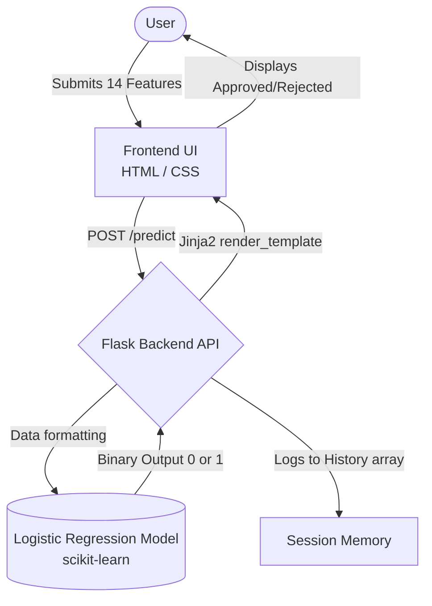

# AI-Powered Loan Approval System

An end-to-end Machine Learning web application that automates loan approval decisions. By analyzing 14 distinct financial and demographic features, the system uses a pre-trained Logistic Regression model to instantly predict whether a loan application should be approved or rejected.

## Features

- **Real-Time Predictions**: Instant loan approval/rejection decisions based on user input.
- **Interactive Analytics Dashboard**: Visualizes overall approval rates, total applications, and distribution across income brackets using Chart.js.
- **Session History Log**: Tracks 100% of user queries and predictions during the session.
- **Responsive UI**: Clean, user-friendly interface built with HTML, custom CSS, and Jinja2 templating.

---

## Technologies & Skills Used

<div align="center">
  
  
  
  
  
  
  
</div>
<br/>

### Backend
- **Python**: Core programming language.
- **Flask**: Lightweight WSGI web application framework to build the REST API and serve pages.
- **Jinja2**: Server-side templating engine to dynamically inject Python data into HTML.

### Machine Learning
- **Scikit-Learn**: Used to build and train the Logistic Regression classification model.
- **NumPy**: For high-performance array and numerical data processing.
- **Pickle**: For serializing and loading the pre-trained ML model (`.pkl`).

### Frontend
- **HTML5 & CSS3**: Custom responsive design without relying on heavy frameworks.
- **Chart.js**: Client-side library for rendering dynamic doughnut and bar charts in the analytics dashboard.

---

## System Flowchart

The following flowchart illustrates how data moves through the application:



---

## Project Structure

```text
Loan approval system/
├── app.py                           # Main Flask application and routes
├── logistic_regression_model.pkl    # Pre-trained ML model
├── requirements.txt                 # Python dependencies
├── static/
│   ├── images/                      # Assets for Approved/Rejected states
│   └── style.css                    # Custom application styling
└── templates/                       # Jinja2 HTML Templates
    ├── index.html / home.html       # Landing pages
    ├── predict.html                 # Prediction form page
    ├── dashboard.html               # High-level metrics view
    ├── analytics.html               # Deep-dive charts (Chart.js)
    ├── history.html                 # Session log table
    └── model.html                   # Educational model info page
```

---

## How to Run Locally

Follow these steps to run the project on your local machine:

1. **Clone the repository (or download the files):**
   Ensure all files and folders (`app.py`, `templates`, `static`, etc.) are in your working directory.

2. **Install the required dependencies:**
   Open your terminal/command prompt and run:
   ```bash
   pip install -r requirements.txt
   ```

3. **Start the Flask server:**
   ```bash
   python app.py
   ```

4. **Access the application:**
   Open your web browser and navigate to:
   ```text
   http://localhost:5050
   ```

---

## Machine Learning Details

The core of this application is a **Logistic Regression** algorithm, a statistical method used for binary classification. 

It evaluates the following 14 features:
* `ApplicantIncome`, `CoapplicantIncome`, `LoanAmount`, `Loan_Amount_Term`
* `Credit_History`, `Gender`, `Marital Status`, `Dependents` (0, 1, 2, 3+)
* `Education Level`, `Employment Status`, `Property Area` (Urban/Semiurban)

Based on patterns learned from historical data, the model outputs a probability that is converted into a binary decision: `1` (Approved) or `0` (Rejected).
